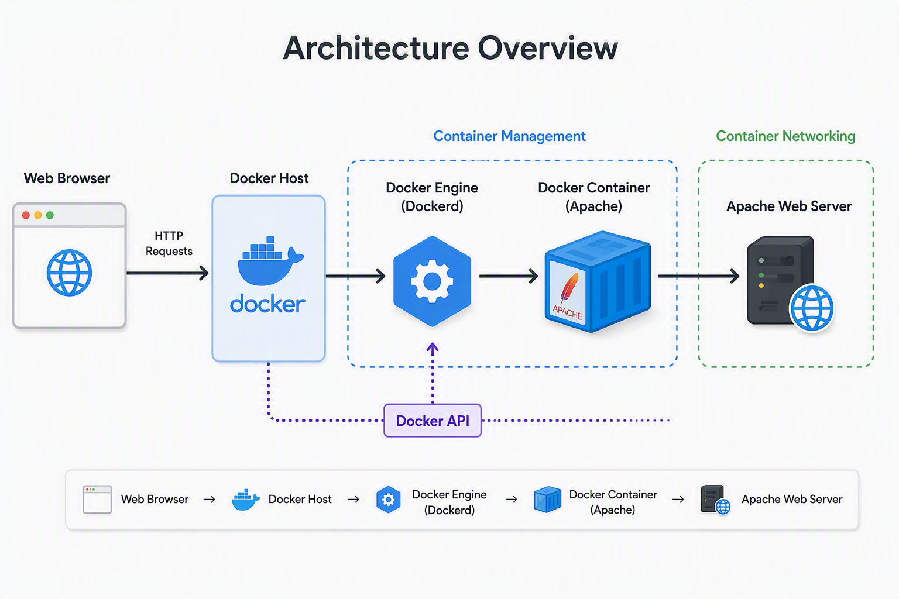

# Dockerizing a Nginx Web Server

This project demonstrates the deployment of an Nginx web server using Docker.


## Architecture

<p>
  
</p>


## What`s Nginx ?

Nginx is a popular web server used to host websites and web applications.

Think of Nginx as the software that receives requests from users' browsers and delivers the requested web pages, images, and files.

## Creating Our Docker File And Adding Our Instructions

Create a file inside your project called Dockerfile.

Inside this file, add this instructions:

```bash
FROM ubuntu:latest
RUN apt-get update && apt-get install -y apache
EXPOSE 80
CMD ["apache2ctl", "-D", "FOREGROUND"]
```

<br>

Explanation line-by-line

<br>

```bash
FROM ubuntu:latest
```
- Uses the latest Ubuntu image as the base.

<br>

```bash
RUN apt-get update && apt-get install -y apache
```
- Update refreshes the package list and install apache automatically without asking for confirmation.

<br>

```bash
EXPOSE 80
```
- Indicates that the container listens on port 80 since it's the default port fot HTTP web traffic.

<br>

```bash
CMD ["apache2ctl", "-D", "FOREGROUND"]
```
- CMD specifies the command that runs when the container starts.
- apache2ctl is Apache's control utility.
- -D FOREGROUND keeps Apache running in the foreground.


## Building Our Image


## Creating the Container Based on Our Nginx Image


