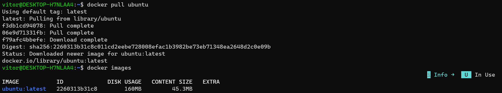
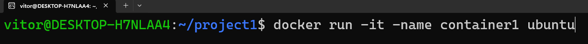
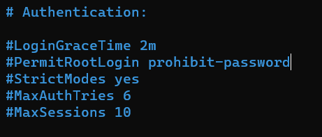
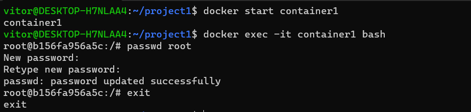

# Setting up an SSH Connection between Two Ubuntu Containers in Docker

This project demonstrates how to configure an SSH connection between two Ubuntu containers running in Docker.

The first container is configured as an SSH server, while the second container acts as an SSH client, allowing them to communicate securely through the SSH protocol.


## Architecture

<p>
  
</p>


<br>

## Creating Container 1

We need to download (pull) a ubuntu image so we can use as a base for our containers.

<p>
  
</p>

We need to start the machine and run some commands so our container has all we need to run as a server:

<p>
  
</p>

Since it's in interact mode, we can install openssh-server and use nano later.


```bash
apt-get update
apt-get install openssh-server
apt-get install nano
```


### To make this container accessible for the Container 2, we need to change sshd_config file:

- In PermitRootLogin, delete prohibited-password and change it to yes

<br>

<p>
  
</p>

<p>
  
</p>

<p>
  
</p>

<p>
  
</p>

<br>

- Press `ctrl+s` to save it and `ctrl+x` to close it.  

- run `exit` to leave container 1.

<br>

## Creating Container 2

Since we already have the ubuntu image, we just need to run this commands:

```bash
`docker run -it —-name container2 ubuntu`
`apt-get update`
`apt-get install openssh-client -y`
```


## Adding a password to access Server in Container 1 and starting the service

<p>
  
</p>

After adding the password, just start the service and exit the container.

```bash
service ssh start
exit
```
<br>

## Connecting from our Host (Container1) to our Server (Container2)

Before connecting, we need to check the IP ADDRESS of container1.

<p>
  
</p>

## Starting Container 2 and connecting to Container 1 using SSH

```bash
`docker start container2`
`docker exec -it container2 bash`
`ssh root@ipaddress`
```