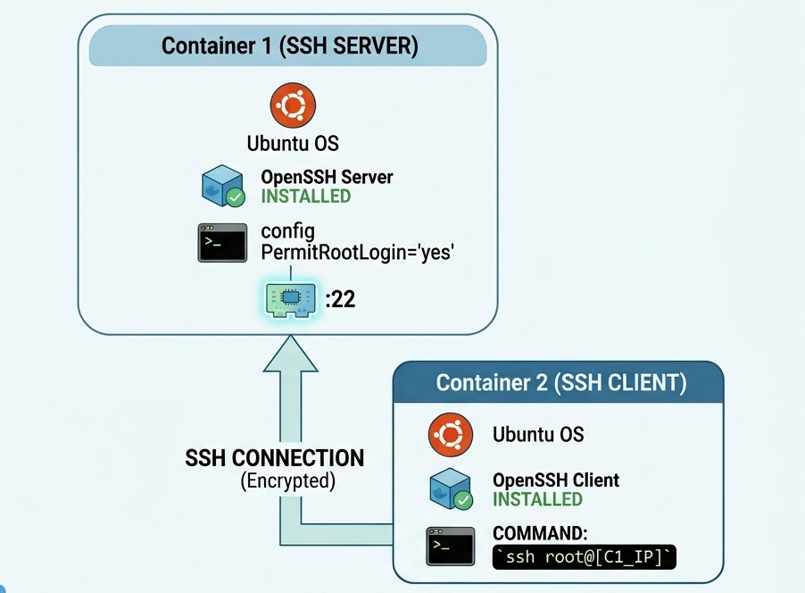

# Setting up an SSH Connection between Two Ubuntu Containers in Docker

This project demonstrates how to configure an SSH connection between two Ubuntu containers running in Docker.

The first container is configured as an SSH server, while the second container acts as an SSH client, allowing them to communicate securely through the SSH protocol.

## Architecture

## Creating Container 1

We need to download (pull) a ubuntu image so we can use as a base for our containers.

[IMAGE]

Since it's in interact mode, we can install openssh-server.

We need to rum some commands so our container has all we need to run as a server:

[IMAGE]

To make this container accessible for the Container 2, we need to change sshd_config file:

- In PermitRootLogin, delete prohibited-password and change it to yes

[IMAGE]

- Press `ctrl+s` to save it and `ctrl+x` to close it.
- run `exit` to leave container 1.

## Creating Container 2

Since we already have the ubuntu image, we just need to run this commands:

[IMAGE]

### Adding a password to access Server in Container 1 and starting the service

- `docker start container1`
- `docker exec -it container1 bash`
    - passwd root
    - Type new password

[IMAGE]

- `service ssh start`
- `exit`

[IMAGE]

## Connecting from our Host (Container1) to our Server (Container2)

Before connecting, we need to check the IP ADDRESS of container1.

[IMAGE]
[IMAGE]

Now we insider Container 2 and we need to connect Container 1 using SSH

[IMAGE]